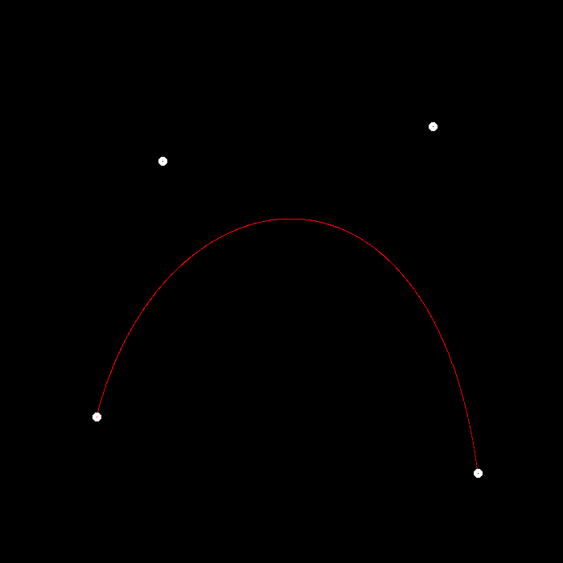
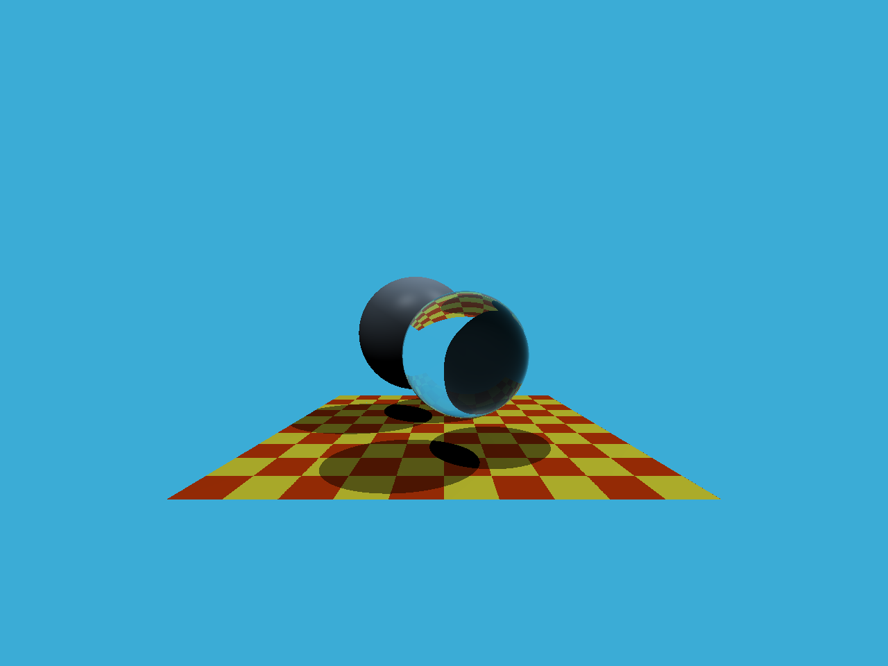
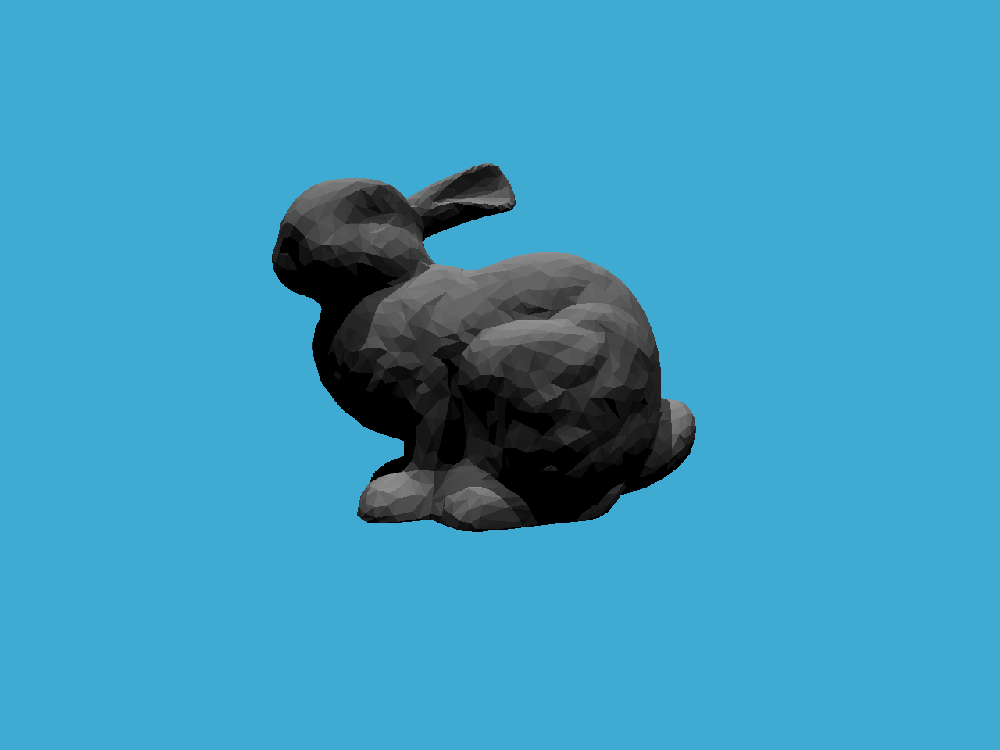
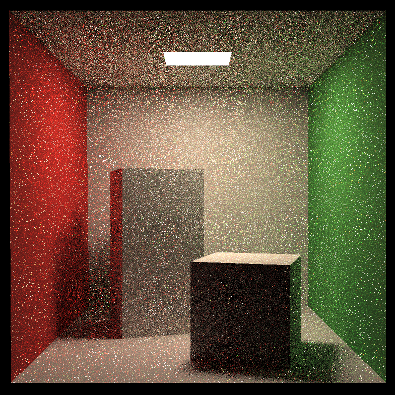
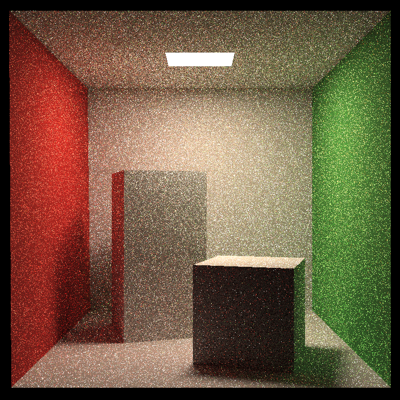
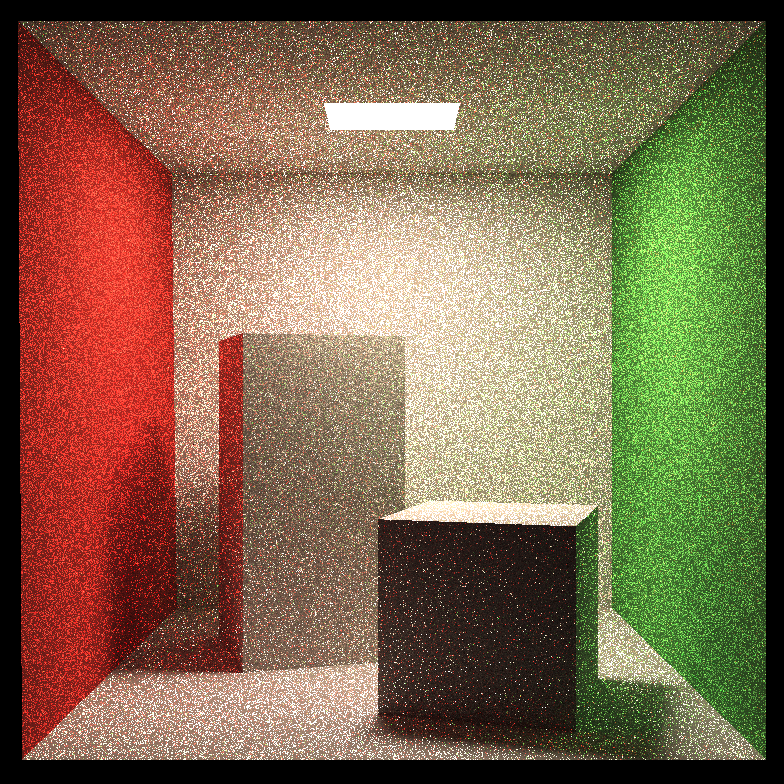
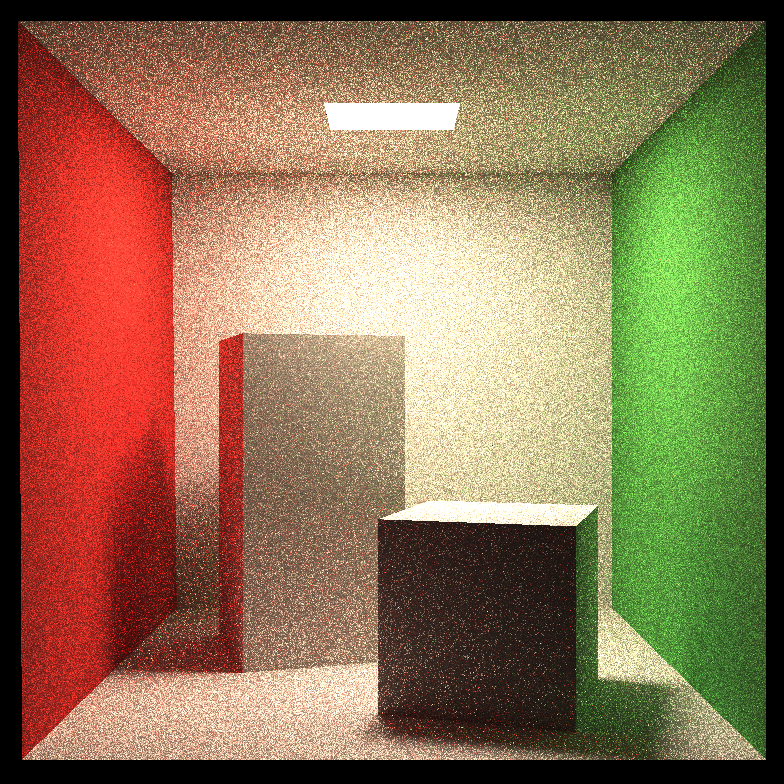

## GAMES 101
This is a collection of the assignments of [Games 101](https://sites.cs.ucsb.edu/~lingqi/teaching/games101.html).

### 1. Transformation

### 2. Z-buffer

### 3. Shading

### 4. Bezier Curve

### 5. Ray Tracing (1, Ray)

### 6. Ray Tracing (2, BVH)

### 7. Ray Tracing (3, Path Tracing)
Using openmp and static random engine for acceleration
- SPP: 4 (Only direct illumination is considered)

- SPP: 4 (global illumination)

- SPP: 16

- SPP: 64

- SPP: 256

The result is still noisy, and will be fixed in latter days.